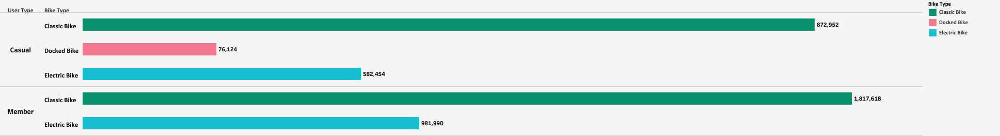
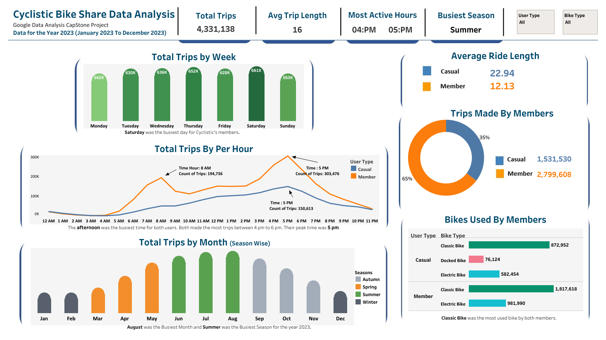

# **Google Data Analytics Capstone: Cyclistic Case Study**
## Author:          Aftab Ahmad
## Date:            24 February, 2024
## Contact:         aftabajk@gmail.com
Course: https://www.coursera.org/learn/google-data-analytics-capstone
# **``Introduction``**:
This capstone project is the final project of my Google Data Analytics Professional Certificate course. In this case study I will analyze a public dataset for a fictitious company provided by the course. For this analysis, I will use the Python programming language, python has an extensive library ecosystem for robust analysis tools and data visualization. To answer the key business questions, I will follow the steps of the data analysis process: **Ask**, **Prepare**, **Process**, **Analyze**, **Share**, and **Act**.

**Quick Links**:
-   [Data Combining](https://github.com/Aftab-Ahmadajk/Google-Data-Analytics-Capstone-Cyclistic-Project/blob/main/cyclistic_portfolio_data_combining.ipynb)
-   [Data Exploration](https://github.com/Aftab-Ahmadajk/Google-Data-Analytics-Capstone-Cyclistic-Project/blob/main/cyclistic_portfolio_cleaning_transforming_saving.ipynb)
-   [Data Cleaning,Transforming & Saving](https://github.com/Aftab-Ahmadajk/Google-Data-Analytics-Capstone-Cyclistic-Project/blob/main/cyclistic_portfolio_cleaning_transforming_saving.ipynb)
-   [Data Analyzation](https://github.com/Aftab-Ahmadajk/Google-Data-Analytics-Capstone-Cyclistic-Project/blob/main/cyclistic_portfolio_data_analyzation.ipynb)
-   [Tableau Dashboard]([https://public.tableau.com/app/profile/aftab.ahmad.khan7133/viz/CyclisticBike-ShareDataAnalysisCapStoneProject/Dashboard1](https://public.tableau.com/views/CyclisticBike-ShareDataAnalysisCapStoneProject/Dashboard1?:language=en-US&:sid=&:display_count=n&:origin=viz_share_link))
# Background
Cyclistic is a fictional bike-share company based in **Chicago**. Cyclistic operates a fleet of  **5800** bicycles which can be accessed by 600 docking stations across Chicago. Bikes can be borrowed from one station and returned at any time to another station in the system. Cyclistic has three pricing plans for its customers.
The majority of riders choose traditional bikes, with only 8% of riders using assistive options. In addition, cyclistic users are more likely to ride for leisure, but about **30%** use them to commute to work each day. Customers who purchase single-ride or full-day passes are referred to as **casual riders** and customers who purchased annual memberships are referred to as **Cyclistic's members**. Finance analysts have concluded that annual members are much more profitable than casual members.
# Scenario
I have completed the **Google Data Analytics Professional Certificate program** on Coursera. In this course, students learn in-demand skills that will make them job-ready in less than 6 months. Upon completion of this program, students are required to complete a data analysis case study to demonstrate the skills learned during this course. As a junior data analyst, I will follow the steps of the data analysis process as mentioned above and find out actionable insights for the stakeholders.

# **``Ask``**
### Develop Understanding:
Lily Moreno, the director of marketing Cyclistic’s bike-share company wants to implement a new marketing strategy. She believes that rather than target new customers there is a very good chance to convert casual riders into members. Therefore, as a junior data analyst I am tasked with analyzing historical data of one year to identify trends such as.
- How Annual members and casual riders use Cyclistic bikes differently?
- Why would causal riders buy Cyclistic annual memberships?
- How can Cyclistic use digital media to influence casual riders to become members?

I am also tasked to produce a report with the following deliverables.
1.	A clear statement of the business task.
2.	A description of all data sources used.
3.	Documentation of any cleaning or manipulation of data.
4.	Supporting visualizations and key findings.
5.	A summary of analysis.
6.	Top three recommendation based on analysis.
### Business Task:
Plan marketing campaigns to convert casual riders into annual members.
### Business Objective:
The business objective of the case study is to discover opportunities for targeted marketing campaigns to convert casual riders into annual member. The objective can be achieved through analyzation of user’s bike trip data and understanding their usage behavior and preferences. The main goal is to increase profitability and drive future growth for the company.
### Stakeholders:
Lily Moreno the director of marketing at Cyclistic is responsible for the implementing the marketing campaigns is 1st stake holder. 
Cyclistic’s marketing team: Marketing Team will be responsible for conducting the analysis and developing the marketing strategy based on the insights gained.  
Cyclistic executive team: The notoriously detail-oriented executive team will decide whether to approve the recommended marketing program.
# **``Prepare``**:
### Data Source:
The data for analysis in this case study was obtained from Motivate International Inc. Link for access this data is (https://divvy-tripdata.s3.amazonaws.com/index.html.)
This is public data that analysts can use to explore how different customer types are using Cyclistic bikes. But note that data-privacy issues prohibit from using riders’ personally identifiable information. 
### Description of Data:
The data used for this project consists of monthly csv files. The data consists in 12 months (January 2023 – December-2023) of historical trips in CSV files having 13 columns and 5,719,877 rows. Each csv file is contained  on 13 columns of data containing details such as ride ID, rider types, ride start and end time, start and end stations, etc. Columns name as ride_id, rideable_type, started_at, ended_at, start_station_name, start_station_id, end_station_name, end_station_id, start_lat, start_lng, end_lat, end_lng, member_casual. The data is organized in a way that allows the data to be analyzed for meaningful results.

Some points that provide a better context for understanding the data are as follows.
- ### Credibility of Data.
The data has been made available by Motivate International Inc. under this license (Data License Agreement | Divvy Bikes) The data is all-inclusive and consistent as it includes information on all rides taken by users. 
- ### Licensing, Privacy,  Security, and accessibility.
The data used for this analysis has user identity protection as all identifying information has been removed and the data is made available under the license for analysis purpose.
- ### The Data Integrity
The data used for this project meets the ROCC standards of integrity.
The data available on (Index of bucket "divvy-tripdata"). It is considered reliable as it provides a comprehensive representation of user behavior. With a large sample size, it effectively reflects the overall population. The data is sourced from Motivate International Inc., making it possible to trace back to the primary source. It is presented in a comprehensive and understandable manner, encompassing relevant variables that capture essential trip information. The data is kept up-to-date with daily and monthly timestamps over a one-year period, and it undergoes regular monthly updates by its owner.
# **``Process``**:
Given the large-scale nature of the dataset, Python was selected as the preferred tool for effective data preparation, cleaning, analysis, and visualization. This choice was made due to Python's extensive libraries, including Pandas, NumPy, Matplotlib, and Seaborn, which offer robust capabilities for handling big data. In contrast, tools like Microsoft Excel, R, and SQL have limitations, such as Excel's maximum capacity of 1,048,576 records, which was insufficient for the dataset containing over 5.8 million records.
### Collecting  and Combining the Dataset.
I have organized the Cyclistic trip datasets for all 12 months into a single folder. Each CSV file has been thoroughly checked to ensure the accuracy and integrity of the dataset by verifying the column names. The files were then uploaded into individual vectors and merged into a consolidated data frame called "tripdata." This resulting data frame comprises 5,719,877 rows and 13 columns. 
### Exploring the Data.
During exploring the data, I found inconsistencies in a dataset and what I observed are as follows:
- To explore what the data looks like I used the head() function which displayed the top five rows of the data frame.
- I checked the size of data frame. The data frame initially contained 74,358,401 data values which is very large.
- I checked the data frame shape. The data frame has 5,719,877 rows and 13 columns.
- I checked the descriptive statistics of the data frame. Initially, I found only 4 numerical variables.
- To got more information about the data I used the info() function. I found missing values and irrelevant data types.
- I checked the duplicate values in the data frame. There were no duplicate values.
### Cleaning the Data.
- After conducting a thorough analysis of the missing data, I  removed it from the dataset. A total of 1,388,739 rows, out of the original 5.7 million rows, were deleted due to missing values.
- Data having a trip duration of less than 1 minute has been removed.
- I conducted data transformation operations, which encompassed tasks such as typecasting and renaming variables, as required.
- Added  9  variables named  trip_duration, month, year, day_of_week, hour and time_hour.
- I dropped the unnecessary data that contained 14 variables.
- Considered trips with negative values less than minute as outliers and removed them from the data.
- Save the Cleaned data into hard drive as a CSV file. 
# **``Analyze``**
In this step I analyzed the cleaned and transformed data, to gain a better understanding of its characteristics and patterns. These insights helped me answer the stakeholder questions below.
- **Question**:  How annual members and casual riders use Cyclistic bikes differently?
### Total Trips Taken.

In the year 2023, annual members accounted for 64.64% of the total trips, recording 2,799,608 trips. Meanwhile, casual members recorded 1,531,530 trips, representing 35.36% of the total trips taken.
###  Usage of Bike Types.

In 2023, annual members accounted for 64.64% of the total trips, making 1,817,618 trips on Classic Bikes (41.97% of total) and 981,990 trips on Electric Bikes (22.67% of total trips). Annual members showed a preference for Classic Bikes over Electric Bikes. Casual members, on the other hand, preferred Classic Bikes as well, making 20.16% of the total trips (872,952 trips), followed by 13.45% of the trips on Electric Bikes (582,592 trips) and 1.76% of the trips on Docked Bikes (76,124 trips). It's worth noting that Docked Bikes were exclusively used by casual members.
### Hourly Trips

During the year, annual members predominantly used bikes for their job site commute at 8 AM (194,736 trips, 4.50% of total trips) and their return journey at 5 PM (303,476 trips, 7.01% of total trips). Conversely, their least active period was at 3 AM (4,703 trips, 0.11% of total trips). Casual members, on the other hand, had their highest bike usage at 5 PM (150,613 trips, 3.48% of total trips) and their lowest at 3 AM (3,589 trips, 0.08% of total trips). Notably, casual members displayed a gradual increase in activity throughout the morning, leading up to their peak at the ending moments of afternoon.
### Weekly Trips

Among annual members, Wednesday had the highest number of trips with 452,679 (10.45% of total trips), while Sunday had the lowest with 307,821 trips (7.11% of total trips). For casual members, Saturday was the most popular day with 310,129 trips (7.16% of total trips), while Monday had the fewest trips at 4.05%.
### Monthly Trips

In August 2023, annual members recorded their highest activity with 351,002 trips (8.10% of total trips), while their lowest activity was in February 2023 with 116,778 trips (2.70% of total trips). For casual members, their highest activity occurred in July 2023 with 245,254 trips (5.66% of total trips), and their lowest activity was in January 2023 with 29,618 trips (0.68% of total trips).
### Seasonal Trips

Summer was the busiest season counting for 39.10% total rides made by both user type and winter was least busiest counting for 10.74% of total rides.
### Average Hourly Trips

During the year, it was observed that annual members maintained a consistent average trip duration throughout the day. In contrast, casual members exhibited higher average trip durations in the afternoon. Notably, casual members recorded the highest average trip duration, which accounted for 27.56% of the total.
### Average Weekly Trips

On Sundays, annual members have the highest average trip duration of 13.61 minutes, while on Mondays, they have the lowest average trip duration of 11.55 minutes. In contrast, casual members have the highest average trip duration of 26.57 minutes on Sundays and the lowest average trip duration of 19.60 minutes on Wednesdays. Throughout the week, casual riders consistently have a higher average trip duration compared to annual members.
### Average Monthly Trips

In July 2023, annual members had the highest average trip duration at 13.35%, while in January 2023, they had the lowest average trip duration at 10.00%. For casual members, the highest average trip duration was also in July 2023 at 25.22%, and the lowest was in January 2023 at 14.88%. Notably, both user types experienced their highest average trip durations during the summer season (June 2023 to August 2023).
### Average Weekly Distance

On Saturdays, annual members covered the highest average distance of 2.11 kilometers, while on Mondays, they covered the lowest average distance of 1.97 kilometers. In comparison, casual members covered the highest average distance of 2.22 kilometers on Saturdays and the lowest average distance of 2.02 kilometers on Wednesdays. It is noteworthy that casual members consistently covered a higher average trip distance than annual members throughout the week.
### Average Monthly Distance

In Jun 2023, annual members covered the highest average distance of 2.22 kilometers (1.07% of total distance) and the lowest average distance of 1.72 kilometers (0.83% of total distance). Similarly, casual members covered the highest average distance of 2.26 kilometers (1.10% of total distance) and the lowest average distance of 1.65 kilometers (0.80% of total distance).
### Average Trip Duration and Distance Covered in the Year 2023
Below bar charts illustrating the average trip duration and distance traveled by users from January 2023 to December 2023. This information provides additional insights into user activity patterns throughout the year.

Annual members have an average trip duration of 12.13 minutes, while casual members have an average trip duration of 22.94 minutes.

Annual members have an average trip distance of 2.04 kilometers per trip, whereas casual members have a slightly higher average trip distance of 2.11 kilometers per trip. Notably, casual members also exhibit a higher average trip duration and overall distance traveled compared to annual members.
## **Summary of Analysis**:
- Annual members had the most trips at 64.64% of total trips.
- The average trip duration among both members was 16 minutes. Casual members had the longest average trip duration, which was 28 minutes.
- The Classic Bike was the most preferred bike type among users. However, it was observed that Docked bikes were exclusively used by Casual members.
- Both Annual members and Casual members predominantly rode their bikes in the afternoon, with the peak time being 5 PM, and least at 3 AM and 4 AM respectively. 
- Saturday emerged as the most popular weekday for both Annual and Casual members, indicating high bike usage. While Annual members showed consistent usage throughout the week with a slight increase on Wednesdays, Casual members demonstrated a similar pattern but with higher usage on weekends, particularly on Saturdays.
- Summer (June – August) was the busiest season for both user types. Both road the most in July 2023, while least in the winter season (December – February) specifically in February 2023. 
# **``Share``**
I have conducted data analysis and extracted valuable insights. To meet stakeholder requirements, I have developed effective data visualizations that connect objectives with the data, enabling compelling data storytelling. I have created a comprehensive dashboard that presents all the data in a unified view, empowering users to make well-informed decisions.

# **``Act``**
The conclusion of the analysis involves deriving insights and recommending solutions based on the problem statement and results. It is not always the analyst who makes the final decision, but rather the role may involve facilitating stakeholders or higher management by providing recommendations informed by the findings. This enables data-driven decision-making at the organizational level. Following are some recommendations based on my analysis.
## Recommendations:
1) Maximize ridership and engagement by implementing weekday discounts for casual riders, encouraging consistent bike-share usage throughout the week. Additionally, highlight the perks of our membership program, personalized to cater to riders' preferences and riding habits.
2)	I recommend offering Cyclistic members priority access during busy hours and discounted pricing during non-busy hours. This strategy will incentivize casual riders to apply for an annual membership, while emphasizing the benefits of membership, such as discounts during peak times like summer or weekends.
3) 3	To enhance the rider experience and encourage engagement, I suggest developing a mobile application that integrates with incorporating features like real-time updates, maps, and route tracking and installing AI Digital Signage at busy stations for casual members. Additionally, implementing a frequent rider program with a point-based incentive system within the membership format will motivate riders to take more trips and earn rewards. This comprehensive approach will improve convenience, provide real-time information, and incentivize riders to increase their usage and loyalty to the bike-share service.
## Resources:
Please find the complete Notebook available in my GitHub repository for access and to check detailed analysis with proper output details of the code . [Github Repositoy](https://github.com/Aftab-Ahmadajk/Google-Data-Analytics-Capstone-Cyclistic-Project/blob/main/cyclistic_portfolio_notebook.ipynb)

For the dashboard, you can find it on my Tableau Public profile. [Tableau Dashboard]([https://public.tableau.com/app/profile/aftab.ahmad.khan7133/viz/CyclisticBike-ShareDataAnalysisCapStoneProject/Dashboard1](https://public.tableau.com/views/CyclisticBike-ShareDataAnalysisCapStoneProject/Dashboard1?:language=en-US&:sid=&:display_count=n&:origin=viz_share_link)https://public.tableau.com/views/CyclisticBike-ShareDataAnalysisCapStoneProject/Dashboard1?:language=en-US&:sid=&:display_count=n&:origin=viz_share_link)

Thank You,

Aftab Ahmad

Data Science Google Data Analytics Cyclistic Bike-Share  #Exploratory Data Analysis

